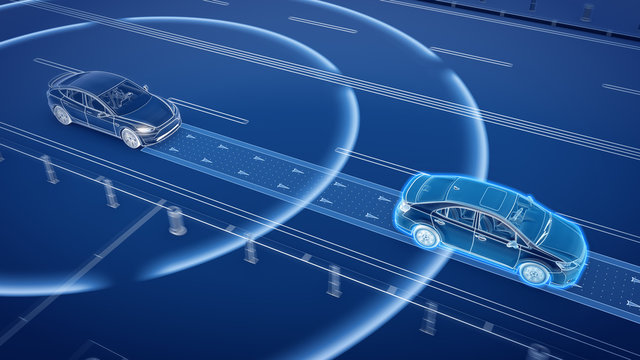

# 
State of California Autonomous Vehicles Reports

## 
Visual exploration of the Self-Driving ecosystem 

California requires operators of self-driving vehices to file detailed reports on and [collisions](https://www.dmv.ca.gov/portal/vehicle-industry-services/autonomous-vehicles/autonomous-vehicle-collision-reports/) and 
annual reports on [miles driven in autonomy and autonomy disengagements](https://www.dmv.ca.gov/portal/vehicle-industry-services/autonomous-vehicles/disengagement-reports/).

This project attempts to gather most publicly available information from the California DMV website pertaining to the testing and deployment of autonomous vehciles, clean and analyze it. Our goal is to understand trends and make discoveries in the autonomous vehicle ecosystem

  

